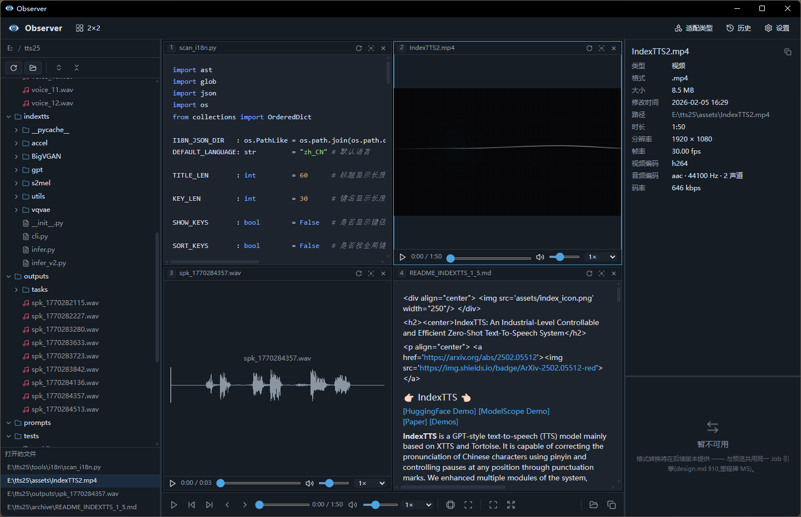

# Observer




**Observe everything from here**

## Structure

```
observer/
├── docs/                design / framework / layout / method
├── observer.png         logo
├── observer-react/      Vite + React
│   └── src/
│       ├── components/  
│       ├── formats/     handlers/
│       ├── stores/      zustand
│       ├── lib/         IPC
│       └── hooks/       OS
└── observer-tauri/      
    ├── src/             main / lib / commands / formats
    ├── capabilities/    
    └── icons/           `pnpm tauri icon`
```

## Enviroment

| tool | version | remark |
|---|---|---|
| Node.js | v24.13.0 | |
| pnpm | 9.15.9 | don't use npm/yarn |
| Rust | 1.97.0 | target `x86_64-pc-windows-msvc` |
| Visual Studio Build Tools | — | need working load(MSVC Linker) |
| WebView2 Runtime | — | Windows 11|

> Tauri CLI **No global installation is required**; It as npm devDependency(`@tauri-apps/cli`) install in `observer-tauri/`, use by `pnpm tauri …`。

**develop enviroment deploy:**

```bash
# frontend
cd observer-react
pnpm install
# backend(@tauri-apps/cli)
cd ../observer-tauri
pnpm install
```

**renew icon:**

```bash
cd observer-tauri
pnpm tauri icon ../observer.png
```

## develop enviroment start

```bash
cd observer-tauri
pnpm dev
```

## project packing

```bash
cd observer-tauri
pnpm build
```

output:

```
observer-tauri/target/release/bundle/{nsis,msi}/
```
